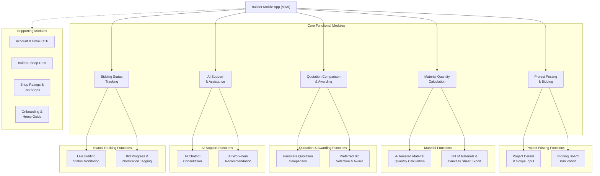
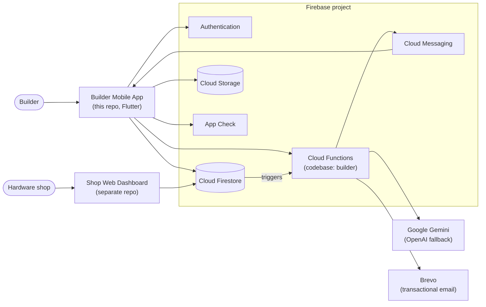

# iConstruct — Builder Mobile App (MAA)

iConstruct is a material-estimation and canvassing tool for home renovation and
extension projects in Region IV-A (CALABARZON): Cavite, Laguna, Batangas, Rizal
and Quezon.

This repository is the **Builder Mobile App**, written in Flutter. A builder
describes a job, and the app computes a Bill of Materials from Philippine
estimating standards. The builder posts that list to hardware shops, compares
the quotations the shops send back, and awards the order. Hardware shops answer
from the **Shop Web Dashboard**, a separate app maintained in another
repository. Both apps share one Firebase project.

The app computes material **quantities**. It never prices them. Every peso
amount comes from a quotation a hardware shop submits, and the AI is not
allowed to state prices.

---

## System architecture

### Functional modules



### System context



The builder app and the shop dashboard never call each other. They exchange
data through Firestore. The app writes a post to `projectPosts`, and a shop's
quotation arrives as `projectPosts/{postId}/quotations/{shopId}`. Cloud
Functions react to those writes to send push notifications and to advance the
builder's estimate through its lifecycle.

---

## Modules and where they live

### 1. Project Posting & Bidding

| Function | What it does | Code |
|---|---|---|
| Project Details & Scope Input | Names the estimate. The builder then chooses coverage and renovation type (cosmetic, functional or structural), picks a template or AI planning, describes the job, measures the room (size, ceiling, doors, windows, tile height) and ticks work items. | `lib/features/project_creation/screens/` (`create_project`, `select_renovation_type`, `select_planning_method`, `describe_project`, `template_area`, `select_work_items`) |
| Bidding Board Publication | Posts the estimate to `projectPosts` with the fields the shop dashboard reads. `onProjectPostCreated` writes a notification and sends a push to every approved shop. | `lib/features/bidding/data/project_post_payload.dart`, `lib/features/bidding/screens/posted_project_details_screen.dart`, `functions/index.js` |

### 2. Material Quantity Calculation

| Function | What it does | Code |
|---|---|---|
| Automated Material Quantity Calculation | Sizes every material line from the measured room, using DPWH Vol. III specifications, Fajardo's *Simplified Construction Estimate* coefficients and NSCP detailing, with waste allowances (8% tile, 5% CHB, 10% roofing lap, and so on). The ticked work items decide which materials are bought, and the estimator decides how much. | `lib/features/project_creation/data/bom_quantity_estimator.dart`, `ph_renovation_rates.dart`, `renovation_templates.dart`, `work_items.dart`, `site_details.dart` |
| Bill of Materials & Canvass Sheet Export | Groups the materials into BOM sections and exports a canvass sheet as a PDF, as PNG pages for chat apps, or to a printer. The price column is left blank for shops to fill in. Work left unticked is listed as not included. | `lib/features/project_creation/data/bom_sections.dart`, `bom_export.dart`, `bom_export_service.dart`, `excluded_work.dart`, `widgets/bom_share_sheet.dart` |

The source behind every rate is documented in
[docs/material-data-sources.md](docs/material-data-sources.md).

### 3. Quotation Comparison & Awarding

| Function | What it does | Code |
|---|---|---|
| Hardware Quotation Comparison | Shows the shops' quotations side by side: the all-in total, how much of the list each shop quoted, and the lines each one skipped. A per-material canvass view compares prices line by line. | `lib/features/bidding/screens/project_bids_screen.dart`, `quotations_screen.dart`, `lib/features/bidding/data/bid_comparison.dart` |
| Preferred Bid Selection & Award | The builder accepts a quotation whole or line by line. Accepting closes the estimate to the other shops. Lines not taken go out again as a new estimate (remainder canvass). A selection can be cancelled with a reason, which reopens the estimate. | `quotation_accept_service.dart`, `partial_acceptance.dart`, `remainder_canvass.dart`, `supplier_cancellation.dart`, `cancelSupplierSelection` in `functions/index.js` |

### 4. AI Support & Assistance

| Function | What it does | Code |
|---|---|---|
| AI Chatbot Consultation | A chat about the job. The AI suggests work items from the project's checklist and never names loose materials, so a chatted estimate uses the same formulas as any other. | `lib/features/project_creation/screens/ai_consultation_screen.dart` → `consultAIMaterials` |
| AI Work-Item Recommendation | Reads the builder's description and pre-ticks the work it calls for, with a reason under each item. The builder decides what stays. | `ai_recommendations_screen.dart` → `generateAIBOM` (`mode: "recommend"`) |

The AI's scope is limited in code as well as in the prompt:

- `functions/src/services/iconstructAi.js` holds the system prompt. The AI
  answers only questions about materials for the current estimate. It gives no
  prices, labour rates, schedules, installation tutorials or structural sign-off.
- `functions/src/services/scopeGuard.js` rejects off-topic messages before the
  model is called and checks the model's output afterwards.
- `functions/src/services/aiQuota.js` limits each account to 40 AI calls per
  day, stored in Firestore.

### 5. Bidding Status Tracking

| Function | What it does | Code |
|---|---|---|
| Live Bidding Status Monitoring | A timeline for each saved estimate, fed by Firestore streams. Cloud Functions advance the stage, so the app never writes it itself. | `lib/features/project_creation/screens/project_tracking_screen.dart`, `data/project_lifecycle.dart`, `onQuotationSubmitted` / `onProjectPostUpdated` |
| Bid Progress & Notification Tagging | Push notifications for new quotations and chat messages, an in-app notification list, unread badges, and stage chips on project cards ("Awaiting bids", "New bids", "Supplier picked"). | `lib/core/services/fcm_service.dart`, `unread_notifications.dart`, `lib/features/notifications/screens/notifications_screen.dart` |

An estimate moves through these stages:

```
Draft → Planning → Waiting for Quotations → Receiving Quotations → Supplier Selected → Completed
                                                                                     ↘ Closed
```

"Completed" means planning and canvassing are done, with materials planned and
a supplier selected. It says nothing about work on site.

### Supporting modules

| Module | What it does | Code |
|---|---|---|
| Account & Email OTP | Registration with a 6-digit email code, OTP-based password reset, profile, change password. | `lib/features/auth/`, `functions/src/services/brevoService.js` |
| Builder–Shop Chat | A conversation opens once a quotation is accepted. Supports image and file attachments. | `lib/features/chat/`, `onChatMessageCreated` |
| Shop Ratings & Top Shops | Builders rate a shop they awarded. Ratings are recomputed on the server and shops are ranked on the home screen. | `lib/features/auth/presentation/{services,widgets}/shop_rat*`, `top_shops_screen.dart`, `onShopRatingWritten` |
| Onboarding & Home Guide | Landing screens and a guided tour of the home screen for first-time users. | `lib/features/onboarding/` |

---

## Cloud Functions

All functions live in `functions/index.js` (Node 20, Firebase codebase `builder`).

| Function | Trigger | Purpose |
|---|---|---|
| `sendEmailOtp` | Callable | Emails a 6-digit code for registration or password reset |
| `confirmBuilderEmailOtp` | Callable | Verifies a code |
| `finalizeEmailOtpRegistration` | Callable | Completes registration and sends the welcome email |
| `resetPasswordWithToken` | Callable | Sets a new password after OTP verification |
| `onProjectPostCreated` | `projectPosts/{postId}` created | Notifies approved shops of a new estimate |
| `onQuotationSubmitted` | `projectPosts/{postId}/quotations/{shopId}` created | Moves the estimate to "Receiving Quotations" and notifies the builder |
| `onProjectPostUpdated` | `projectPosts/{postId}` updated | Copies "Supplier Selected" onto the builder's saved estimate |
| `consultAIMaterials` | Callable | AI chat consultation |
| `generateAIBOM` | Callable | AI work-item recommendation; also serves as the fallback path for consultation |
| `cancelSupplierSelection` | Callable | Cancels an award with a reason and reopens the estimate |
| `onShopRatingWritten` | `shops/{shopId}/ratings/{builderId}` written | Recomputes the shop's rating |
| `onChatMessageCreated` | `conversations/{id}/messages/{id}` created | Sends a push notification for a chat message |

## Main Firestore collections

| Collection | Holds |
|---|---|
| `users/{uid}` and `users/{uid}/saved_projects` | Builder profiles and their saved estimates |
| `projectPosts/{postId}` and `.../quotations/{shopId}` | Posted estimates and the shops' quotations |
| `shops/{shopId}` and `.../ratings/{builderId}` | Hardware shops (written by the dashboard) and builder ratings |
| `conversations/{id}/messages` | Builder–shop chat |
| `notifications` | In-app notification feed |
| `email_otp` | Pending one-time codes (5-minute lifetime) |

Access is enforced by `firestore.rules` and `storage.rules`.

---

## Tech stack

- **App:** Flutter (Dart ≥ 3.10, Flutter ≥ 3.41), Provider, Google Fonts
- **Firebase:** Auth, Cloud Firestore, Cloud Storage, Cloud Functions (v2), Cloud Messaging, App Check
- **AI:** Google Gemini via `@google/genai`, with an optional OpenAI fallback
- **Email:** Brevo transactional API
- **Documents:** `pdf`, `printing`, `share_plus` for canvass sheet export

## Project structure

```
lib/
  core/            shared theme, layout scaling, widgets, Firebase helpers, state, FCM
  features/
    auth/          sign-in, registration, OTP, profile, estimator screens, shop ratings
    project_creation/  estimate flow, templates, work items, quantity estimator, AI screens
    bidding/       posted estimates, quotation comparison, acceptance, cancellation
    chat/          builder–shop conversations
    notifications/ in-app notification feed
    onboarding/    landing screens and home guide
functions/
  index.js         all deployed Cloud Functions
  src/services/    AI, scope guard, quota, email, ratings, chat notify, supplier selection
  test/            Node unit tests and security-rules tests
docs/              material data sources, user flow, visual asset notes
test/              Flutter unit, widget and golden tests
```

---

## Setup

### 1. Firebase services

In the Firebase console, enable:

1. Authentication with the Email/Password provider
2. Cloud Firestore in Native mode
3. Cloud Storage
4. Cloud Messaging
5. App Check

### 2. Functions secrets and settings

API keys are Firebase secrets:

```bash
firebase functions:secrets:set BREVO_API_KEY    # one-time code emails
firebase functions:secrets:set GEMINI_API_KEY   # iConstruct AI
```

Copy `functions/.env.example` to `functions/.env` and set the sender:

```
BREVO_SENDER_NAME=iConstruct
BREVO_SENDER_EMAIL=you@example.com   # must be a verified sender in Brevo
```

Never put either API key in `functions/.env` as well. A variable that is both a
secret and a plain setting makes every deploy fail.

Deploy:

```bash
cd functions && npm install && cd ..
firebase deploy --only functions,firestore,storage
```

If sending a code fails immediately, check the Functions logs. A missing
`BREVO_API_KEY` or an unverified sender is the usual cause.

### 3. Run the app

```bash
flutter pub get
flutter run
```

### 4. Local emulators (optional)

`firebase.json` configures emulators for Functions (5001), Firestore (8080),
Storage (9199) and the Emulator UI (4002):

```bash
firebase emulators:start
```

---

## Tests

```bash
# Flutter unit and widget tests (golden tests are platform-specific)
flutter test --exclude-tags golden

# Cloud Functions unit tests
cd functions && npm test

# Firestore and Storage security rules (starts the emulators)
cd functions && npm run test:rules
```
